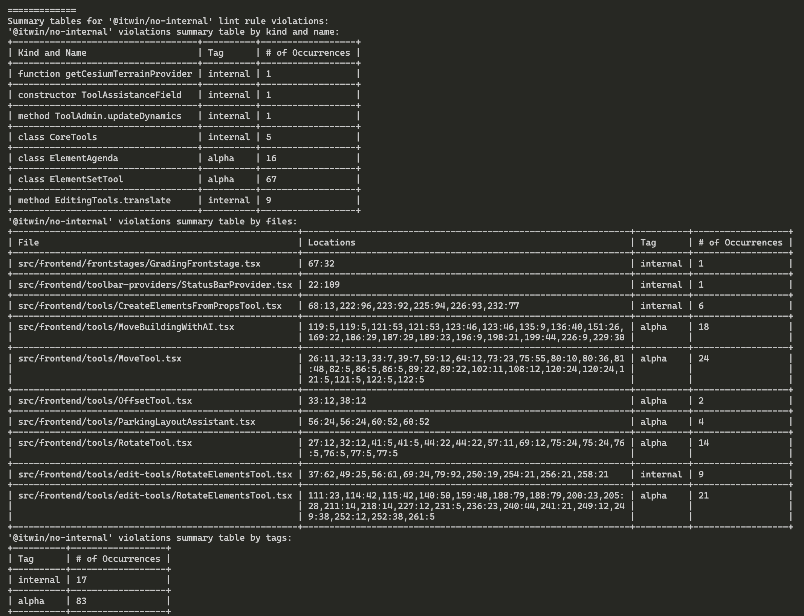

# @itwin/eslint-plugin

ESLint plugin with default configuration and custom rules for iTwin.js projects. For best results, use with Typescript 4.1+

## Installation

You'll first need to install [ESLint](http://eslint.org) and `@itwin/eslint-plugin`:

```json
npm i eslint --save-dev
npm i @itwin/eslint-plugin --save-dev
```

## Using with VSCode

In order for VSCode to use the config file as it is set up, add the following setting to the the VSCode settings (in `.vscode/settings.json`):

```json
"eslint.experimental.useFlatConfig": true,
```

## Usage

Create an `eslint.config.js` file at the root of your project. To set up the file, import `@itwin/eslint-plugin`. Then set the file to export an array of configuration files. This will be done differently depending on whether your project uses ESM or CJS.

### ESM
```javascript
import iTwinPlugin from "@itwin/eslint-plugin";

export default [
  {
    files: ["**/*.{ts,tsx}"],
    ...iTwinPlugin.configs.iTwinjsRecommendedConfig,
  },
  {
    files: ["**/*.{ts,tsx}"],
    ...iTwinPlugin.configs.jsdocConfig,
  },
];
```
### CJS
```javascript
const iTwinPlugin = require("@itwin/eslint-plugin");

module.exports = [
  {
    files: ["**/*.{ts,tsx}"],
    ...iTwinPlugin.configs.iTwinjsRecommendedConfig,
  },
  {
    files: ["**/*.{ts,tsx}"],
    ...iTwinPlugin.configs.jsdocConfig,
  }
];
```

Then configure the rules you want to override, add a section with rules to be overriden and their severity.

```javascript
const iTwinPlugin = require("@itwin/eslint-plugin");

module.exports = [
  {
    files: ["**/*.{ts,tsx}"],
    ...iTwinPlugin.configs.iTwinjsRecommendedConfig,
  },
  {
    files: ["**/*.{ts,tsx}"],
    ...iTwinPlugin.configs.jsdocConfig,
  },
  {
    rules: {
      "@typescript-eslint/no-explicit-any": "error",
    }
  }
];
```

## Rules not in recommended configs

To add rules not set in the recommended configurations, add a plugins section with the `@itwin/eslint-plugin` that was imported. Then, add a rules section with the rule that needs to be added and the severity of error for the rule. 

If a configuration that defines the language parsing options is not used, add a `languageOptions` object. Below is an example of using the `@itwin/no-internal` rule where we define the language options to parse typescript.

### `no-internal` - prevents use of internal/alpha APIs. Example configurations

```javascript
// custom config
const iTwinPlugin = require("@itwin/eslint-plugin");

module.exports = [
  {
    languageOptions: {
      sourceType: "module",
      parser: require("@typescript-eslint/parser"),
      parserOptions: {
        project: "tsconfig.json",
        ecmaVersion: "latest",
        ecmaFeatures: {
          jsx: true,
          modules: true
        },
      },
    },
    plugins: {
      "@itwin": iTwinPlugin
    },
    files: ["**/*.{ts,tsx}"],
    rules: {
      "@itwin/no-internal": "error",
    }
  }
];
```

```javascript
// default config
rules: {
  "@itwin/no-internal": "error"
}
// tag is set to ["internal", "alpha"] by default
```

The rule has some options:

- `tag` - List of tags where the rule will report on usages of APIs documented as them. Allowed tags: `internal`, `alpha`, `beta`, `public`.
  - Default: `internal`, `alpha`
- `checkedPackagePatterns` - List of regex patterns where the rule will only be enforced for APIs that are from a package whose name matches a pattern in the list.
  - Default: `^@itwin/`, `^@bentley/`
- `dontAllowWorkspaceInternal` - Flag that if set to `true`, the rule will be enforced on usages of APIs from packages that are part of the same workspace/monorepo. If set to `false`, usages of APIs from workspace dependencies will not report an error.
  - Default: `false`

## Helper commands

### `no-internal-report` - Runs eslint with the `@itwin/no-internal` rule turned on ("error") using a custom formatter that summarizes the output

This can be run using `npx` or from the scripts section of `package.json`:

```json
  "scripts": {
    "no-internal-report": "no-internal-report \"src/**/*.ts*\""
  },

```

This command forwards all arguments to eslint, so it can be further customized as needed. For example, to specify the tags for the `no-internal` rule:

```json
  "scripts": {
    "no-internal-report": "no-internal-report --tags internal,alpha,beta \"src/**/*.ts*\""
  },

```
In addition to this we also have a custom formatter that can be used to generate a summary table report of the no-internal violations in your codebase.

It creates a easily readable summary table of all your violations. For example:


In addition, this also creates a csv with the same table in the current working directory. You can call it like this:
```sh
eslint ./**/*.{ts,tsx} 1>&2 -f ./node_modules/@itwin/eslint-plugin/dist/formatters/no-internal-summary-with-table.js
```
If you want to import the table creator directly into your code and acquire the string before printing, you can do so by importing the function `noInternalSummaryTableCreator` from `@itwin/eslint-plugin` package, then pass in the [Message[]](https://github.com/evanw/esbuild/blob/fc37c2fa9de2ad77476a6d4a8f1516196b90187e/lib/shared/types.ts#L180) type objects or directly pass in the [LintResult[]](https://github.com/DefinitelyTyped/DefinitelyTyped/blob/24f12f9d70f49911bae646eb8d864ea48b45fae1/types/eslint/index.d.ts#L1412) objects you get when calling [`eslint.lintFiles()`](https://eslint.org/docs/latest/integrate/nodejs-api#-eslintlintfilespatterns).